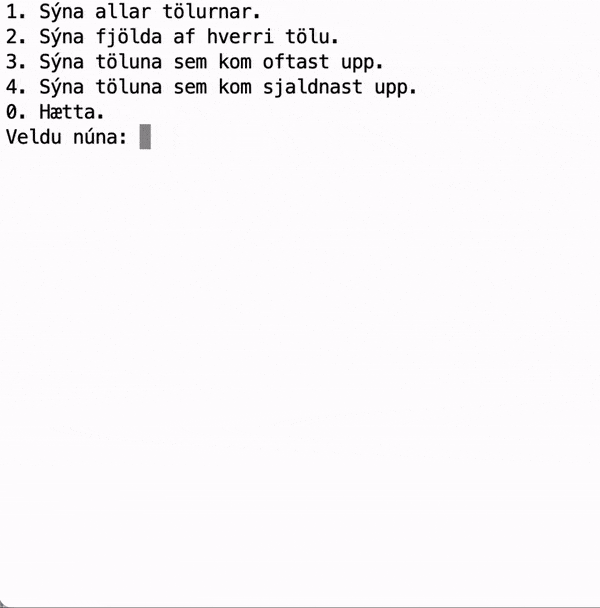

# FORR3CG - Æfingaverkefni 1 - ([lausn](./lausnir/aefingaverkefni_1/))

- **Mælt er með að nota** eingöngu þær aðferðir sem kynntar hafa verið í fyrstu þremur köflum bókarinnar við lausn verkefnisins.

## Verkefnalýsing

Skrifaðu forrit sem tekur 100 (eitthundrað) tölur á bilinu 0 (núll) til og með 9 (níu) af handahófi (e. random) og setur þær í *tvívítt* fylki. Hafðu svo annað fylki (einvítt) sem heldur utan um hversu mikið er af hverri tölu, þ.e. hversu mörg núll, hversu margir einn o.s.frv.

Forritið á svo að birta valmynd þar sem notandinn getur valið um að gera eftirfarandi:

- Sjá allar 100 tölurnar, skrifist út í 10 línum, 10 tölur í línu.
- Sjá fjölda af hverjum tölustaf.
- Sjá töluna sem kom oftast upp. __*__
- Sjá töluna sem kom sjaldnast upp. __*__
- Hætta keyrslu forritsins.

__*__ ekki þarf að bregðast sérstaklega við ef tvær eða fleirri tölur koma jafn oft eða sjaldan upp. Nóg er að birta eina.

Forritið þarf svo að bregðast við með viðeigandi hætti ef notandi velur eitthvað annað en það sem er í boði í valmyndinni.

### Dæmi um virkni



## Bjargir

### Fá kvaðningu í sömu línu og útskrift

```rust
use std::io::Write;

fn main() {
    print!("Veldu núna: ");
    std::io::stdout().flush().expect("Gat ekki hreinsað úttak, enda forrit!!");
    let mut inntak = String::new();
    std::io::stdin()
        .read_line(&mut inntak)
        .expect("Gat ekki lesið frá lyklaborði, enda forrit!!");
    println!("Þú valdir: {}", inntak);
}
```