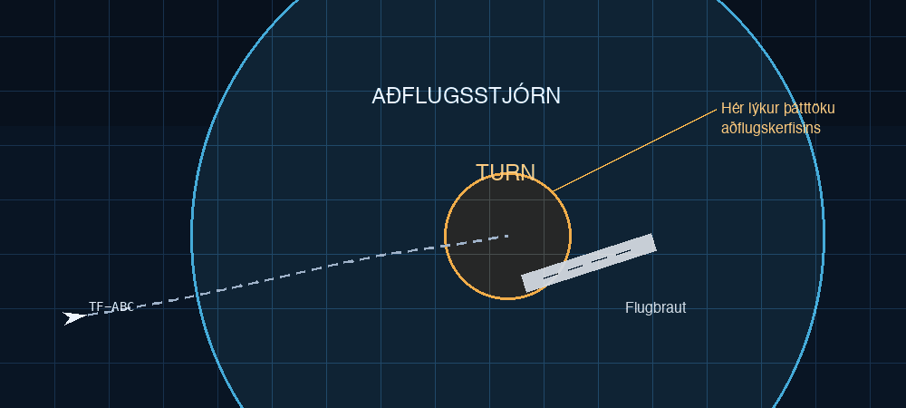

# FORR3CG - Æfingaverkefni 5 - Closure, iter, TryFrom, Oprtion, Result

- **Notaðu** closures og iterators í stað `for` lykkja.

## Verkefnið

Þú ætlar að skrifa hugbúnað sem líkir eftir aðflugsstjórn. Aðflugsstjórn heldur utan um flugvélar sem eru á leið inn til lendingar á flugvelli, þegar flugvélarnar eru svo komnar ákveðið nálægt flugvellinum tekur flugturninn þar við þeim. 



Hver flugvél er með kallmerki (String), hraða í hnútum (u32) og fjarlægð frá flugvelli í sjómílum (i32). Flugvélin þarf svo að geta reiknað út (fall) hversu margar mínútur eru þar til að hún kemur að flugvellinum (tími = fjarlægð/hraði).

Síðan eru flugvélarnar geymdar í lista (Vec) sem er **raðaður** í lækkandi röð eftir hversu margar mínútur eru þar til þær koma að flugvellinum. Ef flugvél er nær flugvelli en 10 sjómílur er hún tekin úr listanum.

Listinn þarf að eiga föll til að skrá flugvél, prenta allar flugvélar, prenta flugvélar sem eru innan ákveðinnar fjarlægðar og svo fall sem uppfærir staðsetningu flugvéla eftir uppgefinn mínútufjölda.

Gerðu svo snyrtilegt notendaviðmót (sambærilegt við [bílasöluna](../Tímar/bilasala_vec/src/main.rs)) með góðri **villumeðhöndlun**.

Fyrir flugvél útfæra `Display` og `TryFrom`.

Fyrir listann útfæra `Display`.

Hvert struct þarf að vera í sér skrá.

Dæmi um notkun:
```bash 
skrá tf-abc 100 300 # skráir TF-ABC, hraði 100 hnútar og fjarlægð 300 sjómílur
skrá tf-ice 200 500
skrá aal5 100 50
skrá tf-efg 100 200
prenta allt
    AAL5, hraði: 100 hn, fjarl.: 50 sm, tími: 30 mín.
    TF-EFG, hraði: 100 hn, fjarl.: 200 sm, tími: 120 mín.
    TF-ICE, hraði: 200 hn, fjarl.: 500 sm, tími: 150 mín.
    TF-ABC, hraði: 100 hn, fjarl.: 300 sm, tími: 180 mín.
prenta 250 # prentar aðeins flugvélar sem eru innan 250 sm. frá flugvelli
    AAL5, hraði: 100 hn, fjarl.: 50 sm, tími: 30 mín.
    TF-EFG, hraði: 100 hn, fjarl.: 200 sm, tími: 120 mín.
uppfæra 40 # lætur 40 mínútur líða
prenta allt # AAL5 farin úr listanum
    TF-EFG, hraði: 100 hn, fjarl.: 134 sm, tími: 80 mín.
    TF-ICE, hraði: 200 hn, fjarl.: 367 sm, tími: 110 mín.
    TF-ABC, hraði: 100 hn, fjarl.: 234 sm, tími: 140 mín.
```

Dæmi um lausn er [hér](./lausnir/aefingaverkefni_5/).
